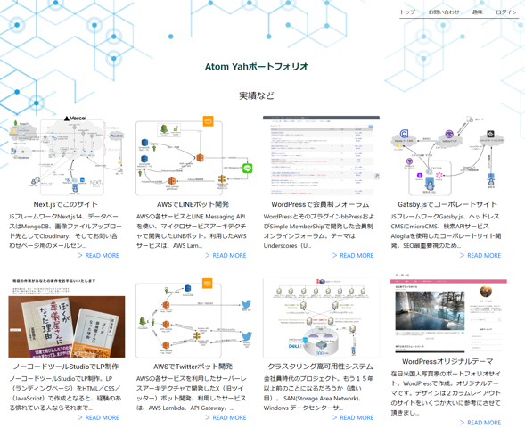
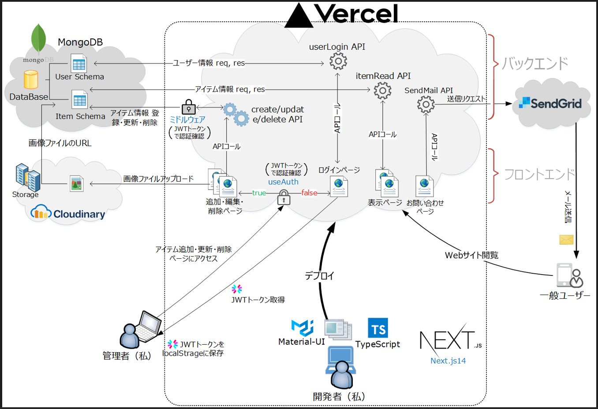

# ポートフォリオサイト

## 使用技術一覧

<!-- シールド一覧 -->
<!-- 該当するプロジェクトの中から任意のものを選ぶ-->
<p style="display: inline">
  <!-- フロントエンドのフレームワーク一覧 -->
  
  
  
  

  <!-- バックエンドのフレームワーク一覧 -->

  <!-- ミドルウェア一覧 -->
  
  
  <!-- インフラ一覧 -->
  
  
  

</p>

## 目次

1. [プロジェクトについて](#プロジェクトについて)
2. [環境](#環境)
3. [ディレクトリ構成](#ディレクトリ構成)
4. [開発環境構築](#開発環境構築)
5. [トラブルシューティング](#トラブルシューティング)

<!-- プロジェクト名を記載 -->

## プロジェクト名

私（Atom Yah）のポートフォリオサイト作成プロジェクト

<!-- URL -->

## ポートフォリオサイト URL

https://my-portfolio-henna-sigma-88.vercel.app/

## 主な画面レイアウト

#### トップページ（実績一覧）



#### 詳細ページ


<!-- プロジェクトについて -->

#### 編集ページ


## プロジェクトについて

１．Angular や Gatsby.js などメインストリームから外れた技術でのフロントエンド案件ばかりやっていたため、自分のポートフォリオサイトを Next.js で制作することにしました。フロントエンドおよびバックエンドともに Next.js14 で構築した、いちおうフルスタックアプリとなっています。
<br />
<br />
２．トップページの「実績」一覧をカードで表示し、それぞれをクリックするとその「詳細」ページに飛ぶシンプルなものです。データは MongoDB に、画像ファイルは Cloudinary に格納させるようにしました。「実績」の追加・編集・削除各ページは、JWT トークンで管理し、認証チェックではじかれるとログイン画面にリダイレクトするよう バックエンド、フトントエンド双方でガードをかけました。

<!-- プロジェクトの概要を記載 -->

<p align="right">(<a href="#top">トップへ</a>)</p>

## 環境

<!-- 言語、フレームワーク、ミドルウェア、インフラの一覧とバージョンを記載 -->

| 言語・フレームワーク・ライブラリー | バージョン |
| ---------------------------------- | ---------- |
| TypeScript                         | 5.2.2      |
| Next.js                            | 14.0.3     |
| mongodb                            | 4.1        |
| mongoose                           | 8.0.1      |
| React                              | 18.2.0     |
| mui/material                       | 5.15.0     |
| next-cloudinary                    | 5.10.0     |
| sendgrid/mail                      | 7.7.0      |
| jsonwebtoken                       | 8.5.1      |

その他のパッケージのバージョンは package.json を参照してください

<p align="right">(<a href="#top">トップへ</a>)</p>

## ディレクトリ構成

<!-- Treeコマンドを使ってディレクトリ構成を記載 -->

<pre>
.next
node_modules
public
src
├─app
│ │ font.ts
│ │ Footer.module.css
│ │ Footer.tsx
│ │ globals.css
│ │ Header.module.css
│ │ Header.tsx
│ │ layout.module.css
│ │ layout.tsx
│ │ loading.module.css
│ │ loading.tsx
│ │ page.module.css
│ │ page.tsx
│ │
│ ├─components
│ │ AdminHeader.module.css
│ │ AdminHeader.tsx
│ │ ImageModal.tsx
│ │ ImgInput.tsx
│ │
│ ├─contact
│ │ page.module.css
│ │ page.tsx
│ │
│ ├─hobby
│ │ page.module.css
│ │ page.tsx
│ │
│ ├─item
│ │ ├─create
│ │ │ │ page.module.css
│ │ │ │ page.tsx
│ │ │ │
│ │ │ └─created
│ │ │ page.module.css
│ │ │ page.tsx
│ │ │
│ │ ├─delete
│ │ │ └─[id]
│ │ │ DeleteForm.tsx
│ │ │ page.module.css
│ │ │ page.tsx
│ │ │
│ │ ├─update
│ │ │ ├─updated
│ │ │ │ page.module.css
│ │ │ │ page.tsx
│ │ │ │
│ │ │ └─[id]
│ │ │ page.module.css
│ │ │ page.tsx
│ │ │ UpdateForm.tsx
│ │ │
│ │ └─[id]
│ │ page.module.css
│ │ page.tsx
│ │ SinglePageView.module.css
│ │ SinglePageView.tsx
│ │
│ ├─thanks
│ │ page.module.css
│ │ page.tsx
│ │
│ └─user
│ ├─login
│ │ page.module.css
│ │ page.tsx
│ │
│ └─register
│ page.module.css
│ page.tsx
│
├─data
│ books.json
│
├─pages
│ └─api
│ │ hello.ts
│ │ sendMail.ts
│ │
│ ├─item
│ │ │ create.ts
│ │ │ readall.ts
│ │ │ [id].ts
│ │ │
│ │ ├─delete
│ │ │ [id].ts
│ │ │
│ │ └─update
│ │ [id].ts
│ │
│ └─user
│ login.ts
│ register.ts
│
└─utils
database.ts
schemaModels.ts
useAuth.ts
.env.local
.eslintrc.json
.gitignore
middleware.ts
next-env.d.ts
next.config.js
package-lock.json
package.json
README.md
tsconfig.json
</pre>

<p align="right">(<a href="#top">トップへ</a>)</p>

## 開発環境構築

<!-- コンテナの作成方法、パッケージのインストール方法など、開発環境構築に必要な情報を記載 -->

### GitHub をクローン

以下のコマンドで当該 GitHub をクローン.

git clone https://github.com/atomyah/MyPortfolio_HomePage

### module をインストール

プロジェクトルートで次のコマンドでモジュール（package.json 記述のモジュール群）をインストール.

`npm install`

### <font color="red">fetch 先 URL を変更</font>

いくつかのファイルにおいて、バックエンドの API を fetch するコードで API パスがフルパスで書かれている.
<br />
例：

<pre>
await fetch(`https://my-portfolio-henna-sigma-88.vercel.app/api/item/readall`, { cache: "no-store" });
</pre>

<font color="red">エディタを使いそのパスの URL 箇所を次のようにローカルサーバーの URL に全置換する.</font>

https://my-portfolio-henna-sigma-88.vercel.app/
を、
http://localhost:3000/
に全置換.

<br />

### 環境変数ファイルを作成

環境変数ファイル.env.local ファイルに記述すべき環境変数リスト

- SENDGRID_KEY=＜ SendGrid より取得する API キー＞
- MONGODB_CONNECT_KEY=＜ MongoDB への接続詞＞
- NEXT_PUBLIC_CLOUDINARY_CLOUD_NAME=＜ Cloudinary より取得する Cloud Name ＞
- NEXT_PUBLIC_CLOUDINARY_PRESET_NAME=＜ Cloudinary より取得する Preset Name ＞

※ ＜ MongoDB への接続詞＞にはユーザー名、パスワード、使用するデータベース名が含まれている.

SendGrid、MongoDB、Cloudinary のダッシュボード より各 API キーおよび接続詞を取得後、.env.local ファイルを作成し、上記環境変数を記述.

### 動作確認

`npm run dev`コマンドで開発サーバーを立ち上げ、
https://my-portfolio-henna-sigma-88.vercel.app にアクセスできるか確認.

### 停止

キーボード Ctrl ＋ C で停止開発サーバーを停止できる.

<p align="right">(<a href="#top">トップへ</a>)</p>

## システム構成図

以下のように、バックエンド、フロントエンドともに Next.js で作られている．



## トラブルシューティング

#### Server error There is a problem with the server configuration. Check the server logs for more information

バックエンドへのアクセスを jwt で認証チェックするミドルウェア（middleware.ts）がエラーを吐いて動作しない.<br />
解決方法：src 配下に配置していた middleware.ts をプロジェクトルートに配置替えすることで解決. 公式では src 配下の配置でも良いので原因は分からない.(src 配下でも Basic 認証であれば middleware.ts は動作した)

#### Right-hand side of 'instanceof' is not an object

フロントエンドの実績追加・編集・削除へのアクセスを制御する useAuth.ts で、jwt.verify がどうしても上記エラーを吐いて動作しない.<br />
解決方法：jsonwebtoken のバージョンを 9.0.1 から 8.5.1 にダウングレードすることで解決. JWT が Reac18 あるいは Next13.x 以降に対応していない？
参考：[TypeScript jsonwebtoken で JWT を verify しようとしたら Right-hand side of 'instanceof' is not an object というエラーになった件](https://chaika.hatenablog.com/entry/2023/04/11/083000)

#### モーダルのスタイルにメディアクエリが使えない

styled-components や module CSS など色々試したが、どうしてもメディアクエリを使うことができなかった. 回避策として、430px 以下の小画面ではモーダルを開かないようにするよう実装.
<br /><br />
参考：現在、モーダル<Modal>のスタイルはインラインで当たっている.

```HTML
<Modal
        isOpen={isModalOpen}
        onRequestClose={handleModalRequestClose}
        style={responsiveModalStyle}
>
  <Image src={} />
  <Button onClick={} />
</Modal>
```

詳細は src/app/item/[id]/SinglePageView.tsx を参照ください。

#### The "images.domains" configuration is deprecated. Please use "images.remotePatterns" configuration instead.

`<Image>`にはアプリケーションをユーザーの攻撃から守るため、外部ドメインの画像読み込みを制限する機構が組み込まれており、画像を読み込むためには next.config.js で画像読み込みを許可するドメインを指定する必要があります。今までは、

```js
images: {
   // Cloudinaryを使うための設定↓
  domains: ["res.cloudinary.com"],
},
```

Next.js 14 から domains の使用は一部の状況を除いて非推奨となり、代わりに remotePatterns の使用が推奨されるようになったようです。

```js
	images: {
		// Cloudinaryを使うための設定↓
		remotePatterns: [
			{
				protocol: "http",
				hostname: "res.cloudinary.com",
				port: "",
				pathname: "/atomyah/**",
			},
		],
	},
```

<p align="right">(<a href="#top">トップへ</a>)</p>
